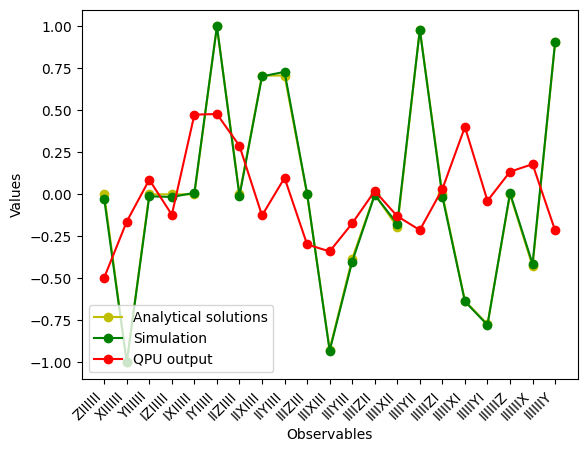
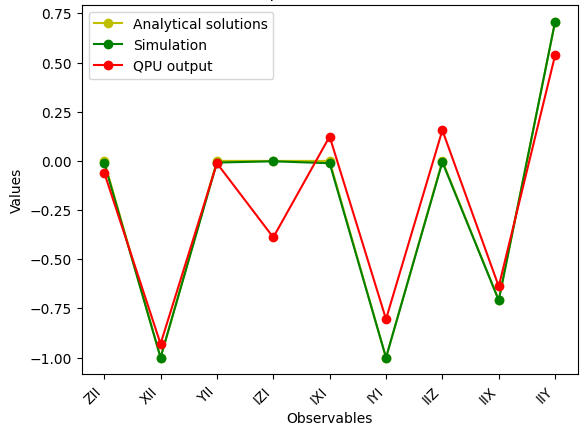

Seven qubit quantum Fourier transform    
=================================  
Musawwadah Mukhtar, PhD  
https://github.com/DrMukhtar  

This is an implementation of a well known quantum algorithm, quantum Fourier transform. This is the first example of my personal project *petitZooQ*, my humble collection of implemented quantum algorithms.    

**Why Quantum Fourier transform?**
Quantum Fourier transform (QFT) is one of essential building block of many other quantum algorithm, including the Shor algorithm known for efficient number factorization. It is a powerful algorithm because the performance scales as $O((\text{log} N)^2)$, an exponential speed-up compared to that of Fast Fourier transform, $N log N$; input size $N$ requires about $log N$ number of qubit .  

**Motivation: Test the smallest non-trivial case for the Shor algorithm**
To my knowledge, case of factorization of 15 would require QFT with 8 qubits in the first register; with the second register, this requires 12 qubits in total. This has motivated me to test QFT with 3 qubits up 7 qubits using the available IBM quantum processors. For each case, I compare the output of the quantum processor with the simulation result and the analytical result. 

### Qiskit application
The Qiskit package used to run the quantum processor includes simulation. Besides, we can also derive the analytical result. However, it would be impractical to simulate more than 15 qubits using your laptop. 

### Presented case
I found the case of seven(7) qubits is the limit of their technology; tested on November 2024. The result is presented in this repository!   

The notebook requires 7 seconds of QPU time, relatively small compared to the 10 minutes of free monthly quota.  

### Result
One important feature of the outcome of the QFT is that the resulting qubits are not entangled despite all the entangling gates.  
One practical measure is to measure the components of the Bloch vector in all seven qubits; x, y and z components for each qubit yield 21 measurements in total! The measurements result are presented in Figure 1.  

|  |
|:--:|
| Figure 1: The average of the measurement shots for the x, y and z components of the seven involved qubits |

As mentioned before, for seven qubits, the measurement results from the QPU are already far from the simulation and the analytical results. I was not surprised as the error of the gate fidelity is said to be around $3 %$. The discrepancies are less significance for the case for the case of three qubits as presented in Figure 2.    

|  |
|:--:|
| Figure 2: The average of the measurement shots for the x, y and z components of three qubits |

### Concluding remarks
While, the code for the three-qubit case will be presented in another future repository, hopefully this gives a positive outlook as the quantum processor performance should improve. This notebook may help you to get alerted with subsequent technological leaps.  

Here, you'll find the jupyter notebook. It's self-contained.    
However, to be able to reproduce the result, you have to install qiskit and have an account to access the IBM quantum processors. Indeed you have to get a token available in you account dashboard.   

### Practical informations
To install Qiskit:  
https://docs.quantum.ibm.com/guides/install-qiskit

With your token, you should be able to run the notebook.  
I would like to point out the prompt to launch the notebook  
`
jupyter notebook path/to/notebook/7qubit_QFT.ipynb
`

I'll try to respond if you have any difficulty to reproduce the result.  
